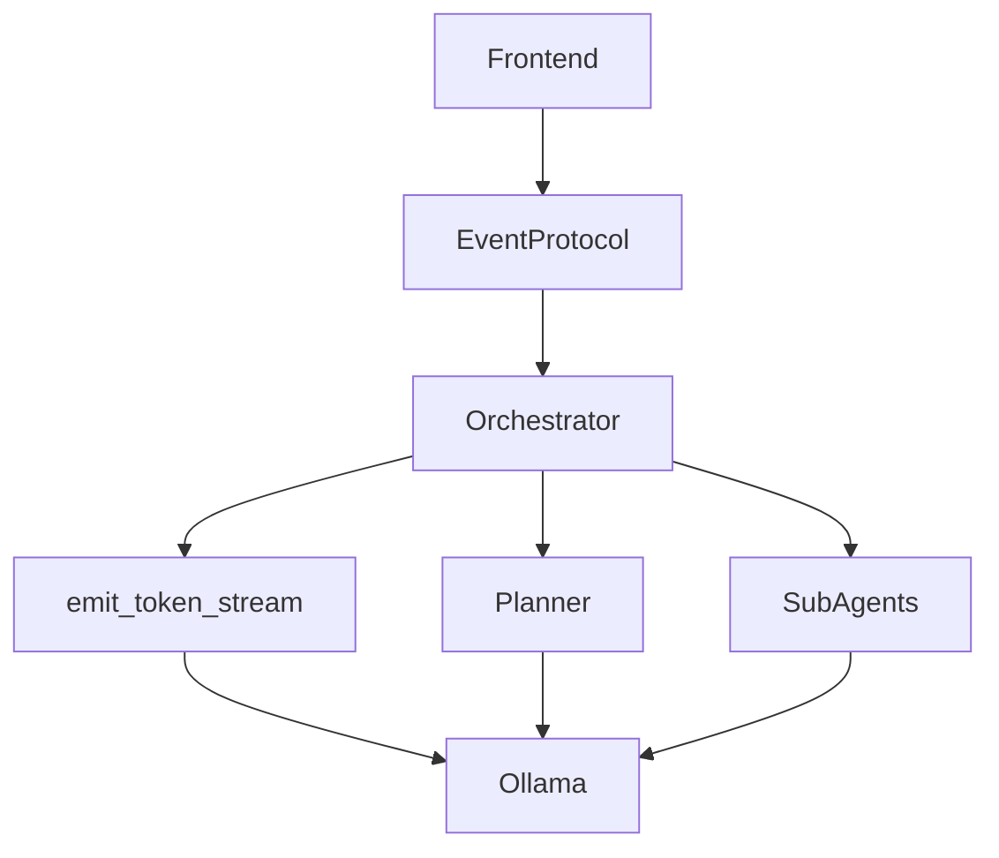
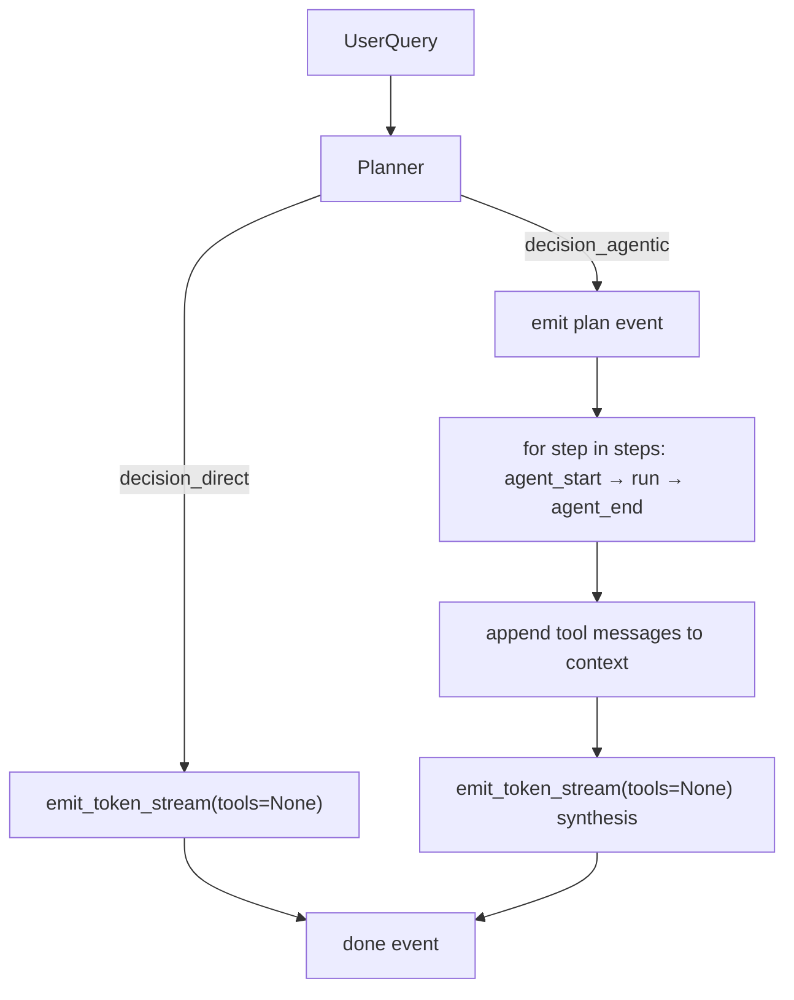

# Agent Runtime Event Protocol

## Current State

The orchestrator in [`backend/agents/orchestrator.py`](backend/agents/orchestrator.py) mixes raw Ollama NDJSON with ad-hoc app events (`agent_start`, `agent_end`, `reset`). The frontend in [`frontend/app/page.tsx`](frontend/app/page.tsx) parses both formats — Ollama via `data.message?.content`, app events via `data.type`.

This causes the reset/flicker problem documented in [`docs/STREAMING.md`](docs/STREAMING.md): tokens stream before tool detection, then `reset` is emitted (frontend doesn't even handle it today).

## Target Architecture



**Core insight:** The stable contract is the event protocol. Planner, agents, and Ollama are replaceable internals.

### Event Protocol (final shape)

| Event | Payload |
|---|---|
| `plan` | `{ content: string, duration_ms?: number }` |
| `agent_start` | `{ agent: string }` |
| `tool_call` | `{ tool: string, args: object, duration_ms?: number }` |
| `agent_end` | `{ agent: string, tools: ToolCall[], duration_ms?: number }` |
| `token` | `{ content: string }` |
| `done` | `{ tokens?: number, tokens_per_sec?: number, duration_ms?: number, total_ms?: number }` |

No `reset` event in the final state.

---

## Phase 1: Own the Protocol

**Goal:** Every line on the wire is `{type: ...}`. Ollama format never reaches the frontend. Behavior unchanged otherwise.

### New file: [`backend/agents/events.py`](backend/agents/events.py)

- `emit(event: dict) -> str` — serializes one NDJSON line
- TypedDict or dataclass definitions for each event shape (Python-side source of truth)

### New file: [`backend/agents/ollama.py`](backend/agents/ollama.py)

Centralize all Ollama HTTP interaction here (currently duplicated in orchestrator and base):

- `async def emit_token_stream(client, model, messages, *, think, tools=None) -> AsyncIterator[str]`
  - Consumes Ollama `stream=True` internally
  - Yields `emit({"type": "token", "content": ...})` per content chunk
  - Yields `emit({"type": "done", ...})` on final chunk using `eval_count` / `eval_duration`
- `async def chat(client, model, messages, *, think, tools=None, stream=False) -> dict` — non-streaming helper (used in Phase 2)

This is the **only** module that knows Ollama's wire format.

### Changes to [`backend/agents/orchestrator.py`](backend/agents/orchestrator.py)

- Replace `yield line + "\n"` with consumption through `emit_token_stream`
- Replace inline `json.dumps({"type": ...})` with `emit({...})`
- Keep existing `while True` loop, `reset`, and Ollama tool-calling logic untouched
- Mark `reset` as deprecated in a comment (removed in Phase 3)

### Changes to [`frontend/app/page.tsx`](frontend/app/page.tsx)

Minimal parser update in the stream loop:

```typescript
if (data.type === "token") {
  finalContent += data.content;
  setStreamingContent(prev => prev + data.content);
} else if (data.type === "done") {
  // no-op for now; stats wired in Phase 4
} else if (data.type === "agent_start") { ... }
else if (data.type === "agent_end") { ... }
else if (data.type === "reset") { ... }  // keep until Phase 3
```

Remove the `data.message?.content` fallback (except optionally for `thinking` if still needed).

### Optional: [`frontend/types/events.ts`](frontend/types/events.ts)

TypeScript union mirroring the Python event types. Can land in Phase 1 or Phase 4.

**Ship criteria:** Direct questions stream via `{type: "token"}` events. Agentic questions behave exactly as today (including reset). No UX change visible to users.

---

## Phase 2: Introduce the Planner

**Goal:** Replace implicit Ollama tool-calling at the orchestrator level with an explicit planning step. Planner subsumes the router — no separate routing abstraction.

### New file: [`backend/agents/planner.py`](backend/agents/planner.py)

Non-streaming LLM call with **no tools**. Prompt instructs the model to return JSON only:

```json
{"decision": "direct"}
```

or

```json
{
  "decision": "agentic",
  "summary": "I'll inspect the repository and trace authentication.",
  "steps": [{"agent": "github_agent", "task": "Find and read auth-related files"}]
}
```

- Use `ollama.chat(stream=False)` from Phase 1
- Parse JSON from response content; handle malformed output with a safe fallback (`decision: "direct"`)
- Return a typed `PlanDecision` dataclass
- Planner prompt lists available agents from `AGENT_MAP` keys

**Do not wire into the live chat path yet.** Validate in isolation:

- Unit test with mocked Ollama responses
- Optional debug endpoint `POST /plan` in [`backend/main.py`](backend/main.py) for manual testing

**Ship criteria:** `planner.plan(model, messages, think)` returns structured decisions. Chat behavior unchanged.

---

## Phase 3: Execute the Plan

**Goal:** Replace the `while True` + Ollama tool-calling loop. Eliminate `reset`. This is the main UX win.

### Rewrite [`backend/agents/orchestrator.py`](backend/agents/orchestrator.py)



New orchestrator flow:

1. `decision = await planner.plan(model, messages, think)`
2. **Direct:** `async for e in emit_token_stream(..., tools=None): yield e` — real token streaming, one LLM call
3. **Agentic:**
   - `yield emit({"type": "plan", "content": decision.summary})`
   - For each `step`: `agent_start` → `AGENT_MAP[step.agent](model, [{"role":"user","content": step.task}], think)` → `agent_end` → append tool message
   - `async for e in emit_token_stream(..., tools=None): yield e` — synthesis pass
4. Track `total_ms` wall-clock, attach to final `done`

**Removed:**
- `while True` Ollama tool loop at orchestrator level
- `TOOLS` / Ollama tool-calling in orchestrator (tools stay inside sub-agents via [`backend/agents/base.py`](backend/agents/base.py))
- `reset` event entirely

Agent invocation changes: `step.task` replaces `fn_args["query"]` from Ollama tool_calls.

### Frontend changes in [`frontend/app/page.tsx`](frontend/app/page.tsx)

- Handle `plan` event — store in `plan` state, render stable plan text during loading
- Remove `reset` handler
- Add explicit `phase` state: `"idle" | "planning" | "executing" | "synthesizing"`
  - `plan` received → `"executing"`
  - first `token` → `"synthesizing"`
  - Render based on phase instead of inferring from populated state vars

**Ship criteria:** Agentic queries show plan → agent panel → streamed synthesis with no content flicker. Direct queries stream immediately with no planning overhead.

---

## Phase 4: Improve Observability

**Goal:** Live timeline and timing stats.

### Backend

- Add optional `on_tool_call` callback to [`backend/agents/base.py`](backend/agents/base.py) `run_agent()` — called before each tool executes, orchestrator wraps into `{type: "tool_call", tool, args, duration_ms}`
- Add `duration_ms` to `plan`, `agent_end`, `tool_call` events (via `time.perf_counter()`)
- Enrich `done` with `tokens`, `tokens_per_sec`, `duration_ms`, `total_ms`

### Frontend

- Handle `tool_call` — append to live agent's tool list as they happen (not only on `agent_end`)
- Display timing inline on agent panel and final answer bubble (per [`docs/STREAMING.md`](docs/STREAMING.md) UX example)
- Use shared types from [`frontend/types/events.ts`](frontend/types/events.ts)

**Ship criteria:** User sees tools appear live during agent execution. Stats shown after `done`.

---

## Doc Update

Update [`docs/STREAMING.md`](docs/STREAMING.md) after Phase 3:

- Replace "non-streaming routing call" section with planner model
- Add "Implementation Phases" section mapping phases 1–4
- Keep event types table (still accurate)
- Note `reset` as removed

---

## Explicitly Out of Scope

- Event bus / pub-sub
- Formal state machine library
- Concurrent or parallel agent execution
- Heuristic hybrid routing (Option C) — planner handles direct vs agentic instead
- Fake token chunking for non-streaming responses
- Multiple orchestrator modes

These can layer on later without frontend rewrites if the event protocol is clean from Phase 1.

---

## Suggested PR Order

| PR | Phase | Risk | User-visible |
|---|---|---|---|
| 1 | Own protocol (backend) | Low | None |
| 2 | Frontend parses protocol | Low | None |
| 3 | Planner (isolated) | Low | None |
| 4 | Wire planner, remove reset | Medium | Plan text, no flicker |
| 5 | Observability | Low | Live tools, stats |
| 6 | Update STREAMING.md | None | Docs only |

PRs 1–2 can merge together. PR 3 can merge before or in parallel with PR 4.
